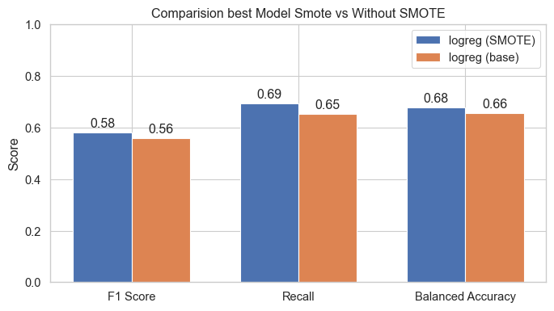

# Student Intervention ML Pipeline

📋 **Table of Contents**

1. [Project Overview](#project-overview)
2. [Repository Structure](#repository-structure)
3. [Installation &amp; Setup](#installation--setup)
4. [Usage](#usage)
5. [Notebook Sections](#notebook-sections)
6. [Interactive Application](#interactive-application)
7. [Results &amp; Visuals](#results--visuals)
8. [Images](#images)
9. [License](#license)
10. [Contact](#contact)

---

## 🚀 Project Overview

The **Student Intervention ML Pipeline** predicts a student's likelihood of passing the final exam via a complete Machine Learning workflow:

* **Data Exploration**: Analyze demographic, academic, and social features.
* **Cleaning & Preprocessing**: Imputation, outlier removal, scaling, and encoding.
* **Modeling**: Train classifiers (Logistic Regression, Decision Trees, Random Forest, XGBoost) with cross-validation.
* **Imbalance Handling**: Use SMOTE to address minority-class detection.
* **Web Application**: Interactive Streamlit dashboard for risk visualization.

---

## 📂 Repository Structure

```
├── data/
│   ├── raw/student-data.csv     # Raw student performance data
│   └── processed/               # Cleaned & preprocessed data
├── notebooks/
│   └── Report.ipynb             # EDA and modeling notebook
├── images/                      # Figures referenced in README
│   ├── correlation_matrix.png
│   ├── feature_importance.png
│   ├── smote_comparison.png
│   ├── pass_fail_proportion.png
│   └── pipeline-diagram.png
├── visualizations.py            # Plotting functions
├── utils.py                     # Preprocessing & feature engineering
├── app.py                       # Streamlit application
├── requirements.txt
└── README.md                    # This file
```

---

## ⚙️ Installation & Setup

1. **Clone the repo**:

   ```bash
   git clone https://github.com/alfredofdlv/student-intervention-ml-pipeline.git
   cd student-intervention-ml-pipeline
   ```
2. **Create & activate virtual environment**:

   ```bash
   python3 -m venv venv
   source venv/bin/activate
   ```
3. **Install dependencies**:

   ```bash
   pip install -r requirements.txt
   ```

---

## ▶️ Usage

* **Notebook**: Reproduce EDA and model training:

  ```bash
  jupyter notebook notebooks/Report.ipynb
  ```
* **Streamlit App**: Launch the dashboard:

  ```bash
  streamlit run app.py
  ```

---

## 📝 Notebook Sections

1. **Data Loading & Cleaning**: import data, handle missing values and outliers.
2. **Exploratory Data Analysis**: distributions, correlations.
3. **Feature Engineering**: create and encode features.
4. **Model Training & Evaluation**: split, tune, and compare models.
5. **Imbalance Handling**: apply SMOTE and assess.
6. **Interpretation**: feature importance and recommendations.

---

## 🌐 Interactive Application

The Streamlit app provides:

* **Risk Dashboard**: individual student fail probabilities
* **Metrics Panels**: F1, Recall, Balanced Accuracy charts
* **Filters**: by demographics or risk level

Run:

```bash
streamlit run app.py
```

---

## 📊 Results & Visuals

### Correlation Matrix

Visualize pairwise feature correlations to identify multicollinearity:


### Feature Importances

Global heatmap of feature importance from the best-performing model:


### SMOTE vs. Base Model Comparison

Comparison of F1 Score, Recall, and Balanced Accuracy with and without SMOTE:



### Pass vs. Fail Proportion

Grid visualization showing the proportion of students who passed vs. failed:


---

## 🖼️ Images

Ensure the following files are in `images/`:

| Filename                   | Description                                    |
| -------------------------- | ---------------------------------------------- |
| pipeline-diagram.png       | Workflow diagram summarizing pipeline steps.   |
| correlation\_matrix.png    | Heatmap of feature correlations.               |
| feature\_importance.png    | Global feature importance heatmap.             |
| smote\_comparison.png      | Bar chart comparing models with/without SMOTE. |
| pass\_fail\_proportion.png | Grid of passed vs. failed student counts.      |

---

## 📜 License

This project is licensed under the **MIT License**. See [LICENSE](LICENSE) for details.

---

## ✉️ Contact

* **Author**: Alfredo Flórez de la Vega & Mateo Bouchet Agudo & Alejandro Móris Lara
* **GitHub**: [alfredofdlv](https://github.com/alfredofdlv) [mateeoBAS](https://github.com/mateoBAS) [alejandromorislara](https://github.com/alejandromorislara)
* **Email**: [alfredoflorezdelavega@gmail.com](mailto:alfredoflorezdelavega@gmail.com)
